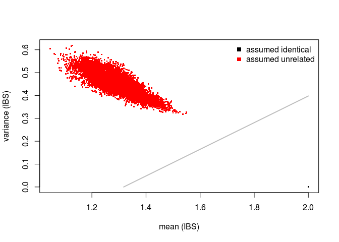
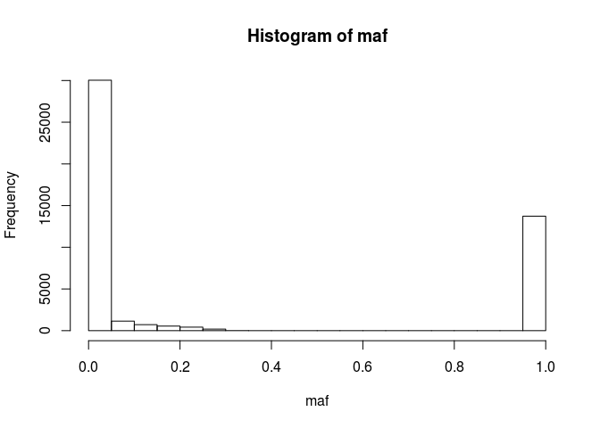
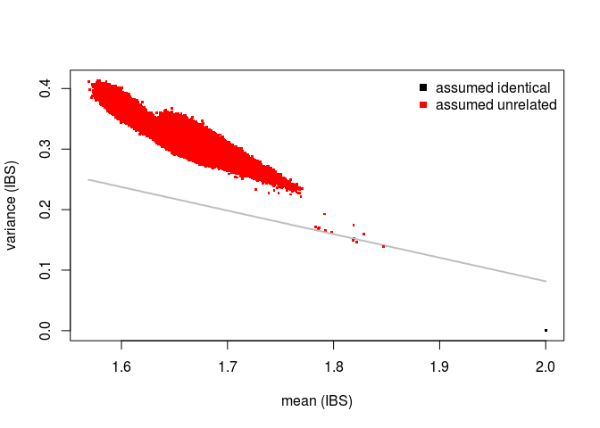
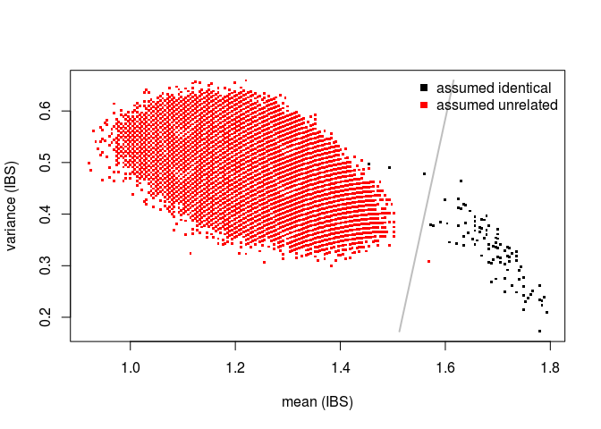
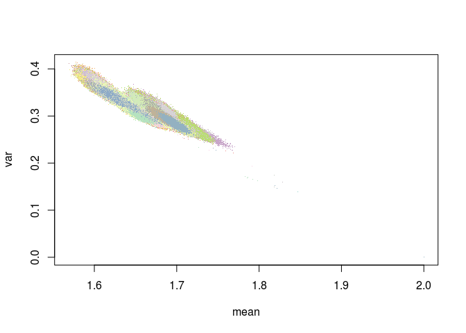
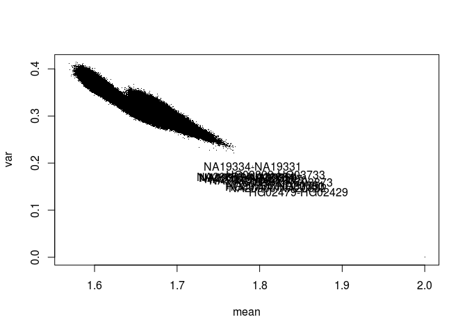

Verifying sample relationships using DNA Methylation data en Whole Genome Sequencing data
================
true
2017-07-19

-   [Methylation Data](#methylation-data)
-   [Genotype Data](#genotype-data)
-   [Genotype and Methylation Data](#genotype-and-methylation-data)
-   [Detect mislabelled samples](#detect-mislabelled-samples)
-   [Customized plots](#customized-plots)
-   [SessionInfo](#sessioninfo)
-   [Reference](#reference)

Methylation Data
================

First we extract the data from GEO using the [*GEOquery*](http://bioconductor.org/packages/GEOquery/)-package and beta-values are extracted using the `exprs`-function:

``` r
library(GEOquery)
gset <- getGEO("GSE39672", GSEMatrix=TRUE) 
```

    ## https://ftp.ncbi.nlm.nih.gov/geo/series/GSE39nnn/GSE39672/matrix/

    ## OK

    ## Found 1 file(s)

    ## GSE39672_series_matrix.txt.gz

    ## Using locally cached version: /tmp/RtmpIFBy5U/GSE39672_series_matrix.txt.gz

    ## Using locally cached version of GPL13534 found here:
    ## /tmp/RtmpIFBy5U/GPL13534.soft

    ## Warning in read.table(file = file, header = header, sep = sep, quote =
    ## quote, : not all columns named in 'colClasses' exist

``` r
gset
```

    ## $GSE39672_series_matrix.txt.gz
    ## ExpressionSet (storageMode: lockedEnvironment)
    ## assayData: 485577 features, 133 samples 
    ##   element names: exprs 
    ## protocolData: none
    ## phenoData
    ##   sampleNames: GSM977267 GSM977268 ... GSM977399 (133 total)
    ##   varLabels: title geo_accession ... data_row_count (37 total)
    ##   varMetadata: labelDescription
    ## featureData
    ##   featureNames: cg00000029 cg00000108 ... rs9839873 (485577 total)
    ##   fvarLabels: ID Name ... SPOT_ID (37 total)
    ##   fvarMetadata: Column Description labelDescription
    ## experimentData: use 'experimentData(object)'
    ## Annotation: GPL13534

``` r
betas <- exprs(gset[[1]]) 
dim(betas)
```

    ## [1] 485577    133

Sample names can be extract from the `gse`-object using the `pData`-function:

``` r
population <- gsub("^.* ", "", pData(gset[[1]])$characteristics_ch1)
table(population)
```

    ## population
    ## CEU YRI 
    ##  60  73

``` r
colnames(betas) <- gsub("^.* ", "", pData(gset[[1]])$title)
betas[1:5, 1:5]
```

    ##            NA19147 NA12750 NA18916 NA12146 NA12057
    ## cg00000029 0.64883 0.49165 0.59442 0.70837 0.48281
    ## cg00000108 0.85525 0.88946 0.90310 0.89617 0.91059
    ## cg00000109 0.78733 0.87134 0.67031 0.80378 0.64081
    ## cg00000165 0.27610 0.28159 0.57978 0.32332 0.52309
    ## cg00000236 0.67505 0.81193 0.77600 0.76603 0.81761

If we would have had the raw idats we could extract the 65 SNPs. However, experiences show that the 65 SNPs available on the array are not enough to perform sample verification with high confidence. Fortunately, several probes on the array contain SNPs occuring frequently in different populations(Chen et al. 2013; Zhou, Laird, and Shen 2016).

We have made the data available from the package [*DNAmArray*](https://github.com/molepi/omicsPrint).

Now we make a selection of CpGs probably affected by polymorphic SNPS in these two populations:

``` r
library(DNAmArray)
data(hm450.manifest.pop.GoNL)
cpgs <- names(hm450.manifest.pop.GoNL[mcols(hm450.manifest.pop.GoNL)$MASK.snp5.CEU
                                      | mcols(hm450.manifest.pop.GoNL)$MASK.snp5.YRI])
```

Next the beta-values are converted to genotypes using our enhanced K-means algorithm:

``` r
library(omicsPrint)
dnamCalls <- beta2genotype(betas[rownames(betas) %in% cpgs, ])
dim(dnamCalls)
```

    ## [1] 1060  133

``` r
dnamCalls[1:5, 1:5]
```

    ##            NA19147 NA12750 NA18916 NA12146 NA12057
    ## cg00009523       3       2       3       2       2
    ## cg00018828       3       2       3       2       1
    ## cg00021325       1       3       2       1       1
    ## cg00025680       1       2       2       3       1
    ## cg00033213       3       3       2       1       1

The DNA methylation based genotype calls can directly supplied to the allelesharing algorithm to perform the intra-omic sample matching:

``` r
data <- alleleSharing(dnamCalls)
```

    ## Hash relations

    ## There are 0 SNP dropped because of low call rate!

    ## There are 0 sample set to NA because too little SNPs called!

    ## Using 1060 polymorphic SNPs to determine allele sharing.

    ## Running `square` IBS algorithm!

    ## 134 of 8911 (1.5%) ...

    ## 8351 of 8911 (93.72%) ...

``` r
mismatches <- inferRelations(data)
```

    ##                   Assumed relation
    ## Predicted relation identical unrelated
    ##          identical       133         .
    ##          unrelated         .      8778



``` r
nrow(data) ##number of pairs
```

    ## [1] 8911

``` r
ncol(dnamCalls) ##identical
```

    ## [1] 133

``` r
ncol(dnamCalls)*(ncol(dnamCalls) - 1)/2 ##non-identical
```

    ## [1] 8778

``` r
ncol(dnamCalls)*(ncol(dnamCalls) + 1)/2 ##total
```

    ## [1] 8911

There are no unknown relations in the data, verifying Moen et al. (2013), as all samples should be unrelated.

> NOTE: the number just represent the number of diagonal elements, off-diagonal (upper or lower) and diagonal + off-diagonal (upper/lower) of the square matrix with sample identifiers.

Genotype Data
=============

Since the sample used in this study (GSE39672) are overlapping with the HapMap and 1000G samples we can extract the whole genome sequencing derived genotypes.

Here is a helper-function for the extraction of genotypes from the 1000G per chromosome vcf-files using the [*VariantAnnotation*](https://bioconductor.org/packages/VariantAnnotation)-package. Furthermore, we use the `genotypeToSnpMatrix`-function to convert genotypes that we directly can use in the allelesharing algorithm.

``` r
getSnpMatrix <- function(chr, samples = NULL, which) {
    require(VariantAnnotation)

    message("Extracting SNPs for chromosome: ", chr)
    
    vcfFile <- paste0("ftp://ftp.1000genomes.ebi.ac.uk/vol1/ftp/release/20130502/ALL.chr", chr,
                      ".phase3_shapeit2_mvncall_integrated_v5a.20130502.genotypes.vcf.gz")

    indexFile <-  paste0("ftp://ftp.1000genomes.ebi.ac.uk/vol1/ftp/release/20130502/ALL.chr", chr,
                         ".phase3_shapeit2_mvncall_integrated_v5a.20130502.genotypes.vcf.gz.tbi")

    tabFile <- TabixFile(vcfFile, indexFile)

    if(is.null(samples))
        param <- ScanVcfParam(geno = "GT",
                              which = which[seqnames(which) == chr])
    else
        param <- ScanVcfParam(geno = "GT",
                              samples = samples,
                              which = which[seqnames(which) == chr])

    message("Reading vcf ...")
    vcf <- readVcf(tabFile, "hg19", param = param)
    
    message("Transform to SnpMatrix ...")
    m <- genotypeToSnpMatrix(vcf)$genotypes

    ##debugging
    ##message(str(m))
    
    m <- t(matrix(as.numeric(m),
                  nrow = nrow(m),
                  ncol = ncol(m),
                  dimnames = dimnames(m)))
    
    rownames(m) <- paste(seqnames(vcf@rowRanges),
                         start(vcf@rowRanges), sep=":")
    m
}
```

Extract genotypes from the vcf-files that are occuring in all populations. Optionally you could extract only those that overlap with the DNA methylation data by suppling the `sample`-names. Now we use a `GenomicRange`-object to specify specifically which SNPs we would like to extract.

This extraction can take some time. We run this on a multi-core machine using 22 cores in combination with the [*BiocParallel*](https://bioconductor.org/packages/BiocParallel)-package.

``` r
library(DNAmArray)
data(hm450.manifest.pop.GoNL)
gr <- hm450.manifest.pop.GoNL[mcols(hm450.manifest.pop.GoNL)$MASK.snp5.CEU
                                      | mcols(hm450.manifest.pop.GoNL)$MASK.snp5.YRI]

mcols(gr) <- NULL
seqlevels(gr) <- mapSeqlevels(seqlevels(gr), "NCBI")
gr
```

    ## GRanges object with 36755 ranges and 0 metadata columns:
    ##              seqnames                 ranges strand
    ##                 <Rle>              <IRanges>  <Rle>
    ##   cg08477687        1       [566570, 566571]      *
    ##   cg00645010        1       [567113, 567114]      *
    ##   cg06402284        1       [762592, 762593]      *
    ##   cg20788133        1       [765028, 765029]      *
    ##   cg09139287        1       [787398, 787399]      *
    ##          ...      ...                    ...    ...
    ##   cg12531767        X [153644319, 153644320]      *
    ##   cg13766601        X [153657086, 153657087]      *
    ##   cg10645377        X [153659893, 153659894]      *
    ##   cg04811950        X [153666533, 153666534]      *
    ##   cg08873063        X [153776107, 153776108]      *
    ##   -------
    ##   seqinfo: 25 sequences from an unspecified genome; no seqlengths

``` r
##check one
##dnaCalls <- getSnpMatrix(22, samples = samples, which=gr)
##dim(dnaCalls)
library(BiocParallel)
register(MulticoreParam(22))
##dnaCalls <- bplapply(1:22, getSnpMatrix, samples = colnames(dnamCalls), which=gr)
dnaCalls <- bplapply(1:22, getSnpMatrix, samples = NULL, which=gr)
dnaCalls <- do.call('rbind', dnaCalls)
dim(dnaCalls)
```

    ## [1] 46786  2504

``` r
dnaCalls[1:5, 1:5]
```

    ##          HG00096 HG00097 HG00099 HG00100 HG00101
    ## 1:668630       0       0       0       0       0
    ## 1:762592       2       3       2       3       3
    ## 1:668630       0       0       0       0       0
    ## 1:765028       1       1       1       1       1
    ## 1:668630       0       0       0       0       0

To select the most informative SNPs, e.g., we can calculate the minor allel frequenties and retain those above a certain threshold, i.e., 0.01 and drop uninformative ones.

``` r
maf <- apply(dnaCalls, 1, function(x) min(table(x)/length(x)))
hist(maf)
```



``` r
dnaCalls <- dnaCalls[maf > 0.01 & maf < 1,]
dim(dnaCalls)
```

    ## [1] 9647 2504

Now we can run the allelesharing algorithm on the genotype data:

``` r
library(omicsPrint)
data <- alleleSharing(dnaCalls)
```

    ## Hash relations

    ## There are 0 SNP dropped because of low call rate!

    ## There are 0 sample set to NA because too little SNPs called!

    ## Using 9647 polymorphic SNPs to determine allele sharing.

    ## Running `square` IBS algorithm!

    ## 2505 of 3136260 (0.08%) ...

    ## 245451 of 3136260 (7.83%) ...

    ## 480901 of 3136260 (15.33%) ...

    ## 706351 of 3136260 (22.52%) ...

    ## 921801 of 3136260 (29.39%) ...

    ## 1127251 of 3136260 (35.94%) ...

    ## 1322701 of 3136260 (42.17%) ...

    ## 1508151 of 3136260 (48.09%) ...

    ## 1683601 of 3136260 (53.68%) ...

    ## 1849051 of 3136260 (58.96%) ...

    ## 2004501 of 3136260 (63.91%) ...

    ## 2149951 of 3136260 (68.55%) ...

    ## 2285401 of 3136260 (72.87%) ...

    ## 2410851 of 3136260 (76.87%) ...

    ## 2526301 of 3136260 (80.55%) ...

    ## 2631751 of 3136260 (83.91%) ...

    ## 2727201 of 3136260 (86.96%) ...

    ## 2812651 of 3136260 (89.68%) ...

    ## 2888101 of 3136260 (92.09%) ...

    ## 2953551 of 3136260 (94.17%) ...

    ## 3009001 of 3136260 (95.94%) ...

    ## 3054451 of 3136260 (97.39%) ...

    ## 3089901 of 3136260 (98.52%) ...

    ## 3115351 of 3136260 (99.33%) ...

    ## 3130801 of 3136260 (99.83%) ...

    ## 3136251 of 3136260 (100%) ...

``` r
mismatches <- inferRelations(data)
```

    ##                   Assumed relation
    ## Predicted relation identical unrelated
    ##          identical      2504         3
    ##          unrelated         .   3133753



``` r
mismatches
```

    ##             mean       var colnames.x colnames.y  relation predicted
    ## 1907749 1.846792 0.1386645    HG02479    HG02429 unrelated identical
    ## 2554683 1.818182 0.1496051    HG03754    HG03750 unrelated identical
    ## 3133426 1.822017 0.1465274    NA20900    NA20882 unrelated identical

``` r
nrow(data) ##number of pairs
```

    ## [1] 3136260

``` r
ncol(dnaCalls) ##identical
```

    ## [1] 2504

``` r
ncol(dnaCalls)*(ncol(dnaCalls) - 1)/2 ##non-identical
```

    ## [1] 3133756

``` r
ncol(dnaCalls)*(ncol(dnaCalls) + 1)/2 ##total
```

    ## [1] 3136260

Three possible family relations seems to appear around mean IBS of 1.8 and variance 0.15.

Genotype and Methylation Data
=============================

To be able to run the allele sharing algorithm between the DNA methylation and genotype data there should be an overlapping set of SNPs.

Here we map probe identifiers to `chromosome:position`, like the genotype data using information for the array provider available from the [*FDb.InfiniumMethylation.hg19*](https://bioconductor.org/packages/FDb.InfiniumMethylation.hg19)-package, and rename to probes.

``` r
library(FDb.InfiniumMethylation.hg19)
rngs <- getPlatform(platform='HM450', genome='hg19')
```

    ## Fetching coordinates for hg19...

``` r
seqlevels(rngs) <- mapSeqlevels(seqlevels(rngs), "NCBI")

map <- names(rngs)
names(map) <- paste(seqnames(rngs),
                    mcols(rngs)$probeTarget, sep=":")
mid <- match(map, rownames(betas))
rownames(betas)[mid] <- names(map)

library(omicsPrint)
dnamCalls <- beta2genotype(betas[rownames(betas) %in% rownames(dnaCalls),])
dim(dnamCalls)
```

    ## [1] 227 133

``` r
dim(dnaCalls)
```

    ## [1] 9647 2504

``` r
data <- alleleSharing(dnamCalls, dnaCalls, phasing=TRUE)
```

    ## Hash relations

    ## There are 0 SNP dropped because of low call rate!

    ## There are 0 sample set to NA because too little SNPs called!

    ## There are 0 SNP dropped because of low call rate!

    ## There are 0 sample set to NA because too little SNPs called!

    ## Using 227 polymophic SNPs to determine allele sharing.

    ## Running `rectangular` IBS algorithm!

    ## 133 of 333032 (0.04%) ...

    ## 13300 of 333032 (3.99%) ...

    ## 26600 of 333032 (7.99%) ...

    ## 39900 of 333032 (11.98%) ...

    ## 53200 of 333032 (15.97%) ...

    ## 66500 of 333032 (19.97%) ...

    ## 79800 of 333032 (23.96%) ...

    ## 93100 of 333032 (27.96%) ...

    ## 106400 of 333032 (31.95%) ...

    ## 119700 of 333032 (35.94%) ...

    ## 133000 of 333032 (39.94%) ...

    ## 146300 of 333032 (43.93%) ...

    ## 159600 of 333032 (47.92%) ...

    ## 172900 of 333032 (51.92%) ...

    ## 186200 of 333032 (55.91%) ...

    ## 199500 of 333032 (59.9%) ...

    ## 212800 of 333032 (63.9%) ...

    ## 226100 of 333032 (67.89%) ...

    ## 239400 of 333032 (71.88%) ...

    ## 252700 of 333032 (75.88%) ...

    ## 266000 of 333032 (79.87%) ...

    ## 279300 of 333032 (83.87%) ...

    ## 292600 of 333032 (87.86%) ...

    ## 305900 of 333032 (91.85%) ...

    ## 319200 of 333032 (95.85%) ...

    ## 332500 of 333032 (99.84%) ...

``` r
mismatches <- inferRelations(data)
```

    ##                   Assumed relation
    ## Predicted relation identical unrelated
    ##          identical       100         1
    ##          unrelated         3    332928



``` r
mismatches
```

    ##            mean       var colnames.x colnames.y  relation predicted
    ## 222117 1.493392 0.4900004    NA11829    NA11829 identical unrelated
    ## 229339 1.559471 0.4776422    NA12716    NA12716 identical unrelated
    ## 229503 1.453744 0.4967448    NA12717    NA12717 identical unrelated
    ## 271889 1.568282 0.3083700    NA19128    NA19129 unrelated identical

``` r
##ncol(dnamCalls) * ncol(dnaCalls) ## now the matrix is rectangular

require(readxl)
file <- tempfile(fileext=".ped")
download.file("ftp://ftp.1000genomes.ebi.ac.uk/vol1/ftp/technical/working/20130606_sample_info/20130606_g1k.ped", destfile=file)

ped <- read.table(file, header=TRUE, sep="\t")
subset(ped, Individual.ID == "NA19129")
```

    ##      Family.ID Individual.ID Paternal.ID Maternal.ID Gender Phenotype
    ## 3468      Y077       NA19129     NA19128     NA19127      2         0
    ##      Population Relationship Siblings Second.Order Third.Order
    ## 3468        YRI        child        0            0           0
    ##      Other.Comments
    ## 3468              0

There are 103 overlapping samples between DNA and DNAm. Three pairs of DNA-DNAm seems not properly matching. I suspect bad quality of DNAm or DNA! And one unrelated is parent offspring relation, for example, this is verified by information from the pedigree file. Using imputed DNA genotypes will increase the number of SNPs overlapping with the DNA methylation data. Further, note that no quality control was performed on the DNAm data (we only have access to the beta-values).

Detect mislabelled samples
==========================

In order to show how mislabelled samples can be detected some mislabeling is artificially introduced, i.e. a known `identical` relation is removed and `unrelated` pair is set to identical.

``` r
set.seed(12345)
relations <- expand.grid(idx = colnames(dnamCalls), idy = colnames(dnaCalls))
relations$relation_type <- "unrelated"
relations$relation_type[as.character(relations$idx) == as.character(relations$idy)] <- "identical"

id <- sample(which(relations$relation_type == "identical"), 1)
relations[id,]
```

    ##            idx     idy relation_type
    ## 271697 NA19119 NA19119     identical

``` r
relations$relation_type[id] <- "unrelated"

id <- sample(which(relations$relation_type == "unrelated"), 1)
relations[id,]
```

    ##            idx     idy relation_type
    ## 291674 NA12057 NA19707     unrelated

``` r
relations$relation_type[id] <- "identical"
relations <- relations[relations$relation_type == "identical",]

library(omicsPrint)
data <- alleleSharing(dnamCalls, dnaCalls, relations=relations, phasing=TRUE)
```

    ## Hash relations

    ## There are 0 SNP dropped because of low call rate!

    ## There are 0 sample set to NA because too little SNPs called!

    ## There are 0 SNP dropped because of low call rate!

    ## There are 0 sample set to NA because too little SNPs called!

    ## Using 227 polymophic SNPs to determine allele sharing.

    ## Running `rectangular` IBS algorithm!

    ## 133 of 333032 (0.04%) ...

    ## 13300 of 333032 (3.99%) ...

    ## 26600 of 333032 (7.99%) ...

    ## 39900 of 333032 (11.98%) ...

    ## 53200 of 333032 (15.97%) ...

    ## 66500 of 333032 (19.97%) ...

    ## 79800 of 333032 (23.96%) ...

    ## 93100 of 333032 (27.96%) ...

    ## 106400 of 333032 (31.95%) ...

    ## 119700 of 333032 (35.94%) ...

    ## 133000 of 333032 (39.94%) ...

    ## 146300 of 333032 (43.93%) ...

    ## 159600 of 333032 (47.92%) ...

    ## 172900 of 333032 (51.92%) ...

    ## 186200 of 333032 (55.91%) ...

    ## 199500 of 333032 (59.9%) ...

    ## 212800 of 333032 (63.9%) ...

    ## 226100 of 333032 (67.89%) ...

    ## 239400 of 333032 (71.88%) ...

    ## 252700 of 333032 (75.88%) ...

    ## 266000 of 333032 (79.87%) ...

    ## 279300 of 333032 (83.87%) ...

    ## 292600 of 333032 (87.86%) ...

    ## 305900 of 333032 (91.85%) ...

    ## 319200 of 333032 (95.85%) ...

    ## 332500 of 333032 (99.84%) ...

``` r
mismatches <- inferRelations(data)
```

    ##                   Assumed relation
    ## Predicted relation identical unrelated
    ##          identical        99         2
    ##          unrelated         4    332927


``` r
mismatches
```

    ##            mean       var colnames.x colnames.y  relation predicted
    ## 222117 1.475771 0.5071537    NA11829    NA11829 identical unrelated
    ## 229339 1.550661 0.4874664    NA12716    NA12716 identical unrelated
    ## 229503 1.444934 0.5046977    NA12717    NA12717 identical unrelated
    ## 271697 1.704846 0.2886047    NA19119    NA19119 unrelated identical
    ## 271889 1.550661 0.3281743    NA19128    NA19129 unrelated identical
    ## 291674 1.193833 0.4755370    NA12057    NA19707 identical unrelated

These mislabel samples (pairs) are automatically detected.

Customized plots
================

Here we show some examples for creating customized plots of the mean and variance of IBS:

``` r
data <- alleleSharing(dnaCalls)
```

    ## Hash relations

    ## There are 0 SNP dropped because of low call rate!

    ## There are 0 sample set to NA because too little SNPs called!

    ## Using 9647 polymorphic SNPs to determine allele sharing.

    ## Running `square` IBS algorithm!

    ## 2505 of 3136260 (0.08%) ...

    ## 245451 of 3136260 (7.83%) ...

    ## 480901 of 3136260 (15.33%) ...

    ## 706351 of 3136260 (22.52%) ...

    ## 921801 of 3136260 (29.39%) ...

    ## 1127251 of 3136260 (35.94%) ...

    ## 1322701 of 3136260 (42.17%) ...

    ## 1508151 of 3136260 (48.09%) ...

    ## 1683601 of 3136260 (53.68%) ...

    ## 1849051 of 3136260 (58.96%) ...

    ## 2004501 of 3136260 (63.91%) ...

    ## 2149951 of 3136260 (68.55%) ...

    ## 2285401 of 3136260 (72.87%) ...

    ## 2410851 of 3136260 (76.87%) ...

    ## 2526301 of 3136260 (80.55%) ...

    ## 2631751 of 3136260 (83.91%) ...

    ## 2727201 of 3136260 (86.96%) ...

    ## 2812651 of 3136260 (89.68%) ...

    ## 2888101 of 3136260 (92.09%) ...

    ## 2953551 of 3136260 (94.17%) ...

    ## 3009001 of 3136260 (95.94%) ...

    ## 3054451 of 3136260 (97.39%) ...

    ## 3089901 of 3136260 (98.52%) ...

    ## 3115351 of 3136260 (99.33%) ...

    ## 3130801 of 3136260 (99.83%) ...

    ## 3136251 of 3136260 (100%) ...

``` r
plotdata <- inferRelations(data, plot.it=FALSE)
```

    ##                   Assumed relation
    ## Predicted relation identical unrelated
    ##          identical      2504         3
    ##          unrelated         .   3133753

``` r
ped <- read.table("ftp://ftp.1000genomes.ebi.ac.uk/vol1/ftp/technical/working/20130606_sample_info/20130606_g1k.ped", header=TRUE, sep="\t")

plotdata$population.x <- plotdata$population.y <- "unknown"
mid <- match(plotdata$colnames.x, ped$Individual.ID)
plotdata$population.x <- ped$Population[mid]
mid <- match(plotdata$colnames.y, ped$Individual.ID)
plotdata$population.y <- ped$Population[mid]

colors <- factor(paste(plotdata$population.x, plotdata$population.y, sep="-"))
levels(colors)
```

    ##   [1] "ACB-ACB" "ACB-CDX" "ACB-CHS" "ACB-CLM" "ACB-FIN" "ACB-GBR" "ACB-GWD"
    ##   [8] "ACB-IBS" "ACB-KHV" "ACB-PEL" "ACB-PJL" "ACB-PUR" "ASW-ACB" "ASW-ASW"
    ##  [15] "ASW-BEB" "ASW-CDX" "ASW-CEU" "ASW-CHB" "ASW-CHS" "ASW-CLM" "ASW-ESN"
    ##  [22] "ASW-FIN" "ASW-GBR" "ASW-GWD" "ASW-IBS" "ASW-ITU" "ASW-JPT" "ASW-KHV"
    ##  [29] "ASW-LWK" "ASW-MSL" "ASW-MXL" "ASW-PEL" "ASW-PJL" "ASW-PUR" "ASW-STU"
    ##  [36] "ASW-YRI" "BEB-ACB" "BEB-BEB" "BEB-CDX" "BEB-CHS" "BEB-CLM" "BEB-ESN"
    ##  [43] "BEB-FIN" "BEB-GBR" "BEB-GWD" "BEB-IBS" "BEB-ITU" "BEB-KHV" "BEB-MSL"
    ##  [50] "BEB-PEL" "BEB-PJL" "BEB-PUR" "BEB-STU" "CDX-ACB" "CDX-CDX" "CDX-CHS"
    ##  [57] "CDX-CLM" "CDX-FIN" "CDX-GBR" "CDX-IBS" "CDX-KHV" "CDX-PEL" "CDX-PJL"
    ##  [64] "CDX-PUR" "CEU-ACB" "CEU-BEB" "CEU-CDX" "CEU-CEU" "CEU-CHS" "CEU-CLM"
    ##  [71] "CEU-ESN" "CEU-FIN" "CEU-GBR" "CEU-GWD" "CEU-IBS" "CEU-ITU" "CEU-KHV"
    ##  [78] "CEU-MSL" "CEU-PEL" "CEU-PJL" "CEU-PUR" "CEU-STU" "CHB-ACB" "CHB-BEB"
    ##  [85] "CHB-CDX" "CHB-CEU" "CHB-CHB" "CHB-CHS" "CHB-CLM" "CHB-ESN" "CHB-FIN"
    ##  [92] "CHB-GBR" "CHB-GWD" "CHB-IBS" "CHB-ITU" "CHB-KHV" "CHB-MSL" "CHB-PEL"
    ##  [99] "CHB-PJL" "CHB-PUR" "CHB-STU" "CHB-YRI" "CHS-CHS" "CHS-FIN" "CHS-GBR"
    ## [106] "CHS-PUR" "CLM-CDX" "CLM-CHS" "CLM-CLM" "CLM-FIN" "CLM-GBR" "CLM-IBS"
    ## [113] "CLM-PUR" "ESN-ACB" "ESN-BEB" "ESN-CDX" "ESN-CHS" "ESN-CLM" "ESN-ESN"
    ## [120] "ESN-FIN" "ESN-GBR" "ESN-GWD" "ESN-IBS" "ESN-KHV" "ESN-MSL" "ESN-PEL"
    ## [127] "ESN-PJL" "ESN-PUR" "FIN-FIN" "FIN-GBR" "GBR-ACB" "GBR-CDX" "GBR-CHS"
    ## [134] "GBR-CLM" "GBR-FIN" "GBR-GBR" "GBR-IBS" "GBR-KHV" "GBR-PEL" "GBR-PJL"
    ## [141] "GBR-PUR" "GIH-ACB" "GIH-ASW" "GIH-BEB" "GIH-CDX" "GIH-CEU" "GIH-CHB"
    ## [148] "GIH-CHS" "GIH-CLM" "GIH-ESN" "GIH-FIN" "GIH-GBR" "GIH-GIH" "GIH-GWD"
    ## [155] "GIH-IBS" "GIH-ITU" "GIH-JPT" "GIH-KHV" "GIH-LWK" "GIH-MSL" "GIH-MXL"
    ## [162] "GIH-PEL" "GIH-PJL" "GIH-PUR" "GIH-STU" "GIH-TSI" "GIH-YRI" "GWD-ACB"
    ## [169] "GWD-BEB" "GWD-CDX" "GWD-CHS" "GWD-CLM" "GWD-ESN" "GWD-FIN" "GWD-GBR"
    ## [176] "GWD-GWD" "GWD-IBS" "GWD-KHV" "GWD-MSL" "GWD-PEL" "GWD-PJL" "GWD-PUR"
    ## [183] "IBS-ACB" "IBS-CDX" "IBS-CHS" "IBS-CLM" "IBS-FIN" "IBS-GBR" "IBS-IBS"
    ## [190] "IBS-KHV" "IBS-PEL" "IBS-PJL" "IBS-PUR" "ITU-ACB" "ITU-BEB" "ITU-CDX"
    ## [197] "ITU-CHS" "ITU-CLM" "ITU-ESN" "ITU-FIN" "ITU-GBR" "ITU-GWD" "ITU-IBS"
    ## [204] "ITU-ITU" "ITU-KHV" "ITU-MSL" "ITU-PEL" "ITU-PJL" "ITU-PUR" "ITU-STU"
    ## [211] "JPT-ACB" "JPT-BEB" "JPT-CDX" "JPT-CEU" "JPT-CHB" "JPT-CHS" "JPT-CLM"
    ## [218] "JPT-ESN" "JPT-FIN" "JPT-GBR" "JPT-GWD" "JPT-IBS" "JPT-ITU" "JPT-JPT"
    ## [225] "JPT-KHV" "JPT-LWK" "JPT-MSL" "JPT-PEL" "JPT-PJL" "JPT-PUR" "JPT-STU"
    ## [232] "JPT-YRI" "KHV-ACB" "KHV-CDX" "KHV-CHS" "KHV-CLM" "KHV-FIN" "KHV-GBR"
    ## [239] "KHV-GWD" "KHV-IBS" "KHV-KHV" "KHV-PEL" "KHV-PJL" "KHV-PUR" "LWK-ACB"
    ## [246] "LWK-BEB" "LWK-CDX" "LWK-CEU" "LWK-CHB" "LWK-CHS" "LWK-CLM" "LWK-ESN"
    ## [253] "LWK-FIN" "LWK-GBR" "LWK-GWD" "LWK-IBS" "LWK-ITU" "LWK-JPT" "LWK-KHV"
    ## [260] "LWK-LWK" "LWK-MSL" "LWK-PEL" "LWK-PJL" "LWK-PUR" "LWK-STU" "LWK-YRI"
    ## [267] "MSL-ACB" "MSL-BEB" "MSL-CDX" "MSL-CHS" "MSL-CLM" "MSL-ESN" "MSL-FIN"
    ## [274] "MSL-GBR" "MSL-GWD" "MSL-IBS" "MSL-KHV" "MSL-MSL" "MSL-PEL" "MSL-PJL"
    ## [281] "MSL-PUR" "MXL-ACB" "MXL-ASW" "MXL-BEB" "MXL-CDX" "MXL-CEU" "MXL-CHB"
    ## [288] "MXL-CHS" "MXL-CLM" "MXL-ESN" "MXL-FIN" "MXL-GBR" "MXL-GWD" "MXL-IBS"
    ## [295] "MXL-ITU" "MXL-JPT" "MXL-KHV" "MXL-LWK" "MXL-MSL" "MXL-MXL" "MXL-PEL"
    ## [302] "MXL-PJL" "MXL-PUR" "MXL-STU" "MXL-YRI" "PEL-ACB" "PEL-CDX" "PEL-CHS"
    ## [309] "PEL-CLM" "PEL-FIN" "PEL-GBR" "PEL-IBS" "PEL-KHV" "PEL-PEL" "PEL-PJL"
    ## [316] "PEL-PUR" "PJL-ACB" "PJL-BEB" "PJL-CDX" "PJL-CHS" "PJL-CLM" "PJL-ESN"
    ## [323] "PJL-FIN" "PJL-GBR" "PJL-GWD" "PJL-IBS" "PJL-ITU" "PJL-KHV" "PJL-MSL"
    ## [330] "PJL-PEL" "PJL-PJL" "PJL-PUR" "PJL-STU" "PUR-CDX" "PUR-CHS" "PUR-CLM"
    ## [337] "PUR-FIN" "PUR-GBR" "PUR-PUR" "STU-ACB" "STU-BEB" "STU-CDX" "STU-CHS"
    ## [344] "STU-CLM" "STU-ESN" "STU-FIN" "STU-GBR" "STU-GWD" "STU-IBS" "STU-ITU"
    ## [351] "STU-KHV" "STU-MSL" "STU-PEL" "STU-PJL" "STU-PUR" "STU-STU" "TSI-ACB"
    ## [358] "TSI-ASW" "TSI-BEB" "TSI-CDX" "TSI-CEU" "TSI-CHB" "TSI-CHS" "TSI-CLM"
    ## [365] "TSI-ESN" "TSI-FIN" "TSI-GBR" "TSI-GWD" "TSI-IBS" "TSI-ITU" "TSI-JPT"
    ## [372] "TSI-KHV" "TSI-LWK" "TSI-MSL" "TSI-MXL" "TSI-PEL" "TSI-PJL" "TSI-PUR"
    ## [379] "TSI-STU" "TSI-TSI" "TSI-YRI" "YRI-ACB" "YRI-BEB" "YRI-CDX" "YRI-CEU"
    ## [386] "YRI-CHB" "YRI-CHS" "YRI-CLM" "YRI-ESN" "YRI-FIN" "YRI-GBR" "YRI-GWD"
    ## [393] "YRI-IBS" "YRI-ITU" "YRI-JPT" "YRI-KHV" "YRI-LWK" "YRI-MSL" "YRI-PEL"
    ## [400] "YRI-PJL" "YRI-PUR" "YRI-STU" "YRI-YRI"

``` r
table(colors)
```

    ## colors
    ## ACB-ACB ACB-CDX ACB-CHS ACB-CLM ACB-FIN ACB-GBR ACB-GWD ACB-IBS ACB-KHV 
    ##    4656    6198   10080    9024    9504    8701     126    9817    7573 
    ## ACB-PEL ACB-PJL ACB-PUR ASW-ACB ASW-ASW ASW-BEB ASW-CDX ASW-CEU ASW-CHB 
    ##    6222     460    9984    5856    1891    5246    5673    6039    6283 
    ## ASW-CHS ASW-CLM ASW-ESN ASW-FIN ASW-GBR ASW-GWD ASW-IBS ASW-ITU ASW-JPT 
    ##    6405    5734    6039    6039    5551    6893    6527    6222    6344 
    ## ASW-KHV ASW-LWK ASW-MSL ASW-MXL ASW-PEL ASW-PJL ASW-PUR ASW-STU ASW-YRI 
    ##    6039    6039    5185    3480    5185    5856    6344    6222    6588 
    ## BEB-ACB BEB-BEB BEB-CDX BEB-CHS BEB-CLM BEB-ESN BEB-FIN BEB-GBR BEB-GWD 
    ##    8256    3741    7998    9030    8084    8194    8514    7826    9646 
    ## BEB-IBS BEB-ITU BEB-KHV BEB-MSL BEB-PEL BEB-PJL BEB-PUR BEB-STU CDX-ACB 
    ##    9202    4063    8514    6970    7310    7788    8944    5040    2730 
    ## CDX-CDX CDX-CHS CDX-CLM CDX-FIN CDX-GBR CDX-IBS CDX-KHV CDX-PEL CDX-PJL 
    ##    4371    9765    7332    9207    8346    7800    5452    4332     312 
    ## CDX-PUR CEU-ACB CEU-BEB CEU-CDX CEU-CEU CEU-CHS CEU-CLM CEU-ESN CEU-FIN 
    ##    8352    9504    8514    9207    4950   10395    9306    9801    9801 
    ## CEU-GBR CEU-GWD CEU-IBS CEU-ITU CEU-KHV CEU-MSL CEU-PEL CEU-PJL CEU-PUR 
    ##    9009   11187   10593   10098    9801    8415    8415    9504   10296 
    ## CEU-STU CHB-ACB CHB-BEB CHB-CDX CHB-CEU CHB-CHB CHB-CHS CHB-CLM CHB-ESN 
    ##   10098    9888    8858    9579   10197    5356   10815    9682   10197 
    ## CHB-FIN CHB-GBR CHB-GWD CHB-IBS CHB-ITU CHB-KHV CHB-MSL CHB-PEL CHB-PJL 
    ##   10197    9373   11639   11021   10506   10197    8755    8755    9888 
    ## CHB-PUR CHB-STU CHB-YRI CHS-CHS CHS-FIN CHS-GBR CHS-PUR CLM-CDX CLM-CHS 
    ##   10712   10506    1957    5565   10395    9030     301    1410    9870 
    ## CLM-CLM CLM-FIN CLM-GBR CLM-IBS CLM-PUR ESN-ACB ESN-BEB ESN-CDX ESN-CHS 
    ##    4465    9306    8144      72    8297    9504     320    9207   10395 
    ## ESN-CLM ESN-ESN ESN-FIN ESN-GBR ESN-GWD ESN-IBS ESN-KHV ESN-MSL ESN-PEL 
    ##    9306    4950    9801    9009   10389   10593    9801    2620    8415 
    ## ESN-PJL ESN-PUR FIN-FIN FIN-GBR GBR-ACB GBR-CDX GBR-CHS GBR-CLM GBR-FIN 
    ##    6369   10296    4950    7987      35     117     525     410    1022 
    ## GBR-GBR GBR-IBS GBR-KHV GBR-PEL GBR-PJL GBR-PUR GIH-ACB GIH-ASW GIH-BEB 
    ##    4186     376     113      78      16     509    9888    6283    8858 
    ## GIH-CDX GIH-CEU GIH-CHB GIH-CHS GIH-CLM GIH-ESN GIH-FIN GIH-GBR GIH-GIH 
    ##    9579   10197   10609   10815    9682   10197   10197    9373    5356 
    ## GIH-GWD GIH-IBS GIH-ITU GIH-JPT GIH-KHV GIH-LWK GIH-MSL GIH-MXL GIH-PEL 
    ##   11639   11021   10506   10712   10197   10197    8755    6592    8755 
    ## GIH-PJL GIH-PUR GIH-STU GIH-TSI GIH-YRI GWD-ACB GWD-BEB GWD-CDX GWD-CHS 
    ##    9888   10712   10506   11021   11124   10722      72   10509   11865 
    ## GWD-CLM GWD-ESN GWD-FIN GWD-GBR GWD-GWD GWD-IBS GWD-KHV GWD-MSL GWD-PEL 
    ##   10622     798   11187   10283    6441   12091   11171     326    9605 
    ## GWD-PJL GWD-PUR IBS-ACB IBS-CDX IBS-CHS IBS-CLM IBS-FIN IBS-GBR IBS-IBS 
    ##    4514   11752     455    2151   11235    9986   10593    9361    5778 
    ## IBS-KHV IBS-PEL IBS-PJL IBS-PUR ITU-ACB ITU-BEB ITU-CDX ITU-CHS ITU-CLM 
    ##    1655    1200     332   11128    9792    4709    9486   10710    9588 
    ## ITU-ESN ITU-FIN ITU-GBR ITU-GWD ITU-IBS ITU-ITU ITU-KHV ITU-MSL ITU-PEL 
    ##   10098   10098    9282   11526   10914    5253   10098    8670    8670 
    ## ITU-PJL ITU-PUR ITU-STU JPT-ACB JPT-BEB JPT-CDX JPT-CEU JPT-CHB JPT-CHS 
    ##    9756   10608    6951    9984    8944    9672   10296   10712   10920 
    ## JPT-CLM JPT-ESN JPT-FIN JPT-GBR JPT-GWD JPT-IBS JPT-ITU JPT-JPT JPT-KHV 
    ##    9776   10296   10296    9464   11752   11128   10608    5460   10296 
    ## JPT-LWK JPT-MSL JPT-PEL JPT-PJL JPT-PUR JPT-STU JPT-YRI KHV-ACB KHV-CDX 
    ##     612    8840    8840    9984   10816   10608    4992    1931    3755 
    ## KHV-CHS KHV-CLM KHV-FIN KHV-GBR KHV-GWD KHV-IBS KHV-KHV KHV-PEL KHV-PJL 
    ##   10395    9306    9801    8896      16    8938    4950    3525     412 
    ## KHV-PUR LWK-ACB LWK-BEB LWK-CDX LWK-CEU LWK-CHB LWK-CHS LWK-CLM LWK-ESN 
    ##   10296    9504    8514    9207    9801   10197   10395    9306    9801 
    ## LWK-FIN LWK-GBR LWK-GWD LWK-IBS LWK-ITU LWK-JPT LWK-KHV LWK-LWK LWK-MSL 
    ##    9801    9009   11187   10593   10098    9684    9801    4950    8415 
    ## LWK-PEL LWK-PJL LWK-PUR LWK-STU LWK-YRI MSL-ACB MSL-BEB MSL-CDX MSL-CHS 
    ##    8415    9504   10296   10098    9612    8160     340    7905    8925 
    ## MSL-CLM MSL-ESN MSL-FIN MSL-GBR MSL-GWD MSL-IBS MSL-KHV MSL-MSL MSL-PEL 
    ##    7990    5795    8415    7735    9279    9095    8415    3655    7225 
    ## MSL-PJL MSL-PUR MXL-ACB MXL-ASW MXL-BEB MXL-CDX MXL-CEU MXL-CHB MXL-CHS 
    ##    5724    8840    6144     424    5504    5952    6336    6592    6720 
    ## MXL-CLM MXL-ESN MXL-FIN MXL-GBR MXL-GWD MXL-IBS MXL-ITU MXL-JPT MXL-KHV 
    ##    6016    6336    6336    5824    7232    6848    6528    6656    6336 
    ## MXL-LWK MXL-MSL MXL-MXL MXL-PEL MXL-PJL MXL-PUR MXL-STU MXL-YRI PEL-ACB 
    ##    6336    5440    2080    5440    6144    6656    6528    6912    1938 
    ## PEL-CDX PEL-CHS PEL-CLM PEL-FIN PEL-GBR PEL-IBS PEL-KHV PEL-PEL PEL-PJL 
    ##    3573    8925    7990    8415    7657    7895    4890    3655     316 
    ## PEL-PUR PJL-ACB PJL-BEB PJL-CDX PJL-CHS PJL-CLM PJL-ESN PJL-FIN PJL-GBR 
    ##    8840    8756     468    8616   10080    9024    3135    9504    8720 
    ## PJL-GWD PJL-IBS PJL-ITU PJL-KHV PJL-MSL PJL-PEL PJL-PJL PJL-PUR PJL-STU 
    ##    6334    9940      36    9092    2436    7844    4656    9984     305 
    ## PUR-CDX PUR-CHS PUR-CLM PUR-FIN PUR-GBR PUR-PUR STU-ACB STU-BEB STU-CDX 
    ##    1320   10619    1479   10296    8955    5460    9792    3732    9486 
    ## STU-CHS STU-CLM STU-ESN STU-FIN STU-GBR STU-GWD STU-IBS STU-ITU STU-KHV 
    ##   10710    9588   10098   10098    9282   11526   10914    3453   10098 
    ## STU-MSL STU-PEL STU-PJL STU-PUR STU-STU TSI-ACB TSI-ASW TSI-BEB TSI-CDX 
    ##    8670    8670    9487   10608    5253   10272    6527    9202    9951 
    ## TSI-CEU TSI-CHB TSI-CHS TSI-CLM TSI-ESN TSI-FIN TSI-GBR TSI-GWD TSI-IBS 
    ##   10593   11021   11235   10058   10593   10593    9737   12091   11449 
    ## TSI-ITU TSI-JPT TSI-KHV TSI-LWK TSI-MSL TSI-MXL TSI-PEL TSI-PJL TSI-PUR 
    ##   10914   11128   10593   10593    9095    6848    9095   10272   11128 
    ## TSI-STU TSI-TSI TSI-YRI YRI-ACB YRI-BEB YRI-CDX YRI-CEU YRI-CHB YRI-CHS 
    ##   10914    5778   11556   10368    9288   10044   10692    9167   11340 
    ## YRI-CLM YRI-ESN YRI-FIN YRI-GBR YRI-GWD YRI-IBS YRI-ITU YRI-JPT YRI-KHV 
    ##   10152   10692   10692    9828   12204   11556   11016    6240   10692 
    ## YRI-LWK YRI-MSL YRI-PEL YRI-PJL YRI-PUR YRI-STU YRI-YRI 
    ##    1080    9180    9180   10368   11232   11016    5886

``` r
library(RColorBrewer)
levels(colors) <- colorRampPalette(brewer.pal(12,"Set3"))(403)
 
with(plotdata, 
     plot(mean, var, pch=".", col=as.character(colors))
     )
```



``` r
##high light some pairs
with(plotdata, {
     plot(mean, var, pch=".")
     id <- var < 0.2 & var > 0.1     
     text(jitter(mean[id], 2), jitter(var[id], 2),
          labels=paste(plotdata$colnames.x[id], plotdata$colnames.y[id], sep="-"))
     })
```



SessionInfo
===========

``` r
sessionInfo()
```

    ## R version 3.3.2 (2016-10-31)
    ## Platform: x86_64-pc-linux-gnu (64-bit)
    ## Running under: Ubuntu 16.04.2 LTS
    ## 
    ## locale:
    ##  [1] LC_CTYPE=en_US.UTF-8       LC_NUMERIC=C              
    ##  [3] LC_TIME=en_US.UTF-8        LC_COLLATE=en_US.UTF-8    
    ##  [5] LC_MONETARY=en_US.UTF-8    LC_MESSAGES=en_US.UTF-8   
    ##  [7] LC_PAPER=en_US.UTF-8       LC_NAME=C                 
    ##  [9] LC_ADDRESS=C               LC_TELEPHONE=C            
    ## [11] LC_MEASUREMENT=en_US.UTF-8 LC_IDENTIFICATION=C       
    ## 
    ## attached base packages:
    ## [1] stats4    parallel  methods   stats     graphics  grDevices utils    
    ## [8] datasets  base     
    ## 
    ## other attached packages:
    ##  [1] readxl_1.0.0                           
    ##  [2] BiocParallel_1.8.2                     
    ##  [3] DNAmArray_0.0.2                        
    ##  [4] minfi_1.20.2                           
    ##  [5] bumphunter_1.14.0                      
    ##  [6] locfit_1.5-9.1                         
    ##  [7] iterators_1.0.8                        
    ##  [8] foreach_1.4.3                          
    ##  [9] Biostrings_2.42.1                      
    ## [10] XVector_0.14.1                         
    ## [11] SummarizedExperiment_1.4.0             
    ## [12] FDb.InfiniumMethylation.hg19_2.2.0     
    ## [13] org.Hs.eg.db_3.4.0                     
    ## [14] TxDb.Hsapiens.UCSC.hg19.knownGene_3.2.2
    ## [15] GenomicFeatures_1.26.4                 
    ## [16] AnnotationDbi_1.36.2                   
    ## [17] GenomicRanges_1.26.4                   
    ## [18] GenomeInfoDb_1.10.3                    
    ## [19] IRanges_2.8.2                          
    ## [20] S4Vectors_0.12.2                       
    ## [21] GEOquery_2.40.0                        
    ## [22] Biobase_2.34.0                         
    ## [23] BiocGenerics_0.20.0                    
    ## [24] omicsPrint_0.99.8                      
    ## [25] MASS_7.3-47                            
    ## [26] BiocStyle_2.2.1                        
    ## 
    ## loaded via a namespace (and not attached):
    ##  [1] httr_1.2.1               nor1mix_1.2-2           
    ##  [3] bit64_0.9-7              splines_3.3.2           
    ##  [5] doRNG_1.6.6              blob_1.1.0              
    ##  [7] cellranger_1.1.0         Rsamtools_1.26.2        
    ##  [9] yaml_2.1.14              RSQLite_2.0             
    ## [11] backports_1.1.0          lattice_0.20-35         
    ## [13] quadprog_1.5-5           limma_3.30.13           
    ## [15] digest_0.6.12            RColorBrewer_1.1-2      
    ## [17] preprocessCore_1.36.0    htmltools_0.3.6         
    ## [19] Matrix_1.2-10            plyr_1.8.4              
    ## [21] siggenes_1.48.0          XML_3.98-1.9            
    ## [23] pkgconfig_2.0.1          biomaRt_2.30.0          
    ## [25] genefilter_1.56.0        zlibbioc_1.20.0         
    ## [27] xtable_1.8-2             RevoUtilsMath_10.0.0    
    ## [29] annotate_1.52.1          openssl_0.9.6           
    ## [31] tibble_1.3.3             beanplot_1.2            
    ## [33] pkgmaker_0.22            survival_2.41-3         
    ## [35] magrittr_1.5             mclust_5.3              
    ## [37] memoise_1.1.0            evaluate_0.10.1         
    ## [39] nlme_3.1-131             data.table_1.10.4       
    ## [41] tools_3.3.2              registry_0.3            
    ## [43] matrixStats_0.52.2       stringr_1.2.0           
    ## [45] rngtools_1.2.4           base64_2.0              
    ## [47] rlang_0.1.1              grid_3.3.2              
    ## [49] RCurl_1.95-4.8           bitops_1.0-6            
    ## [51] rmarkdown_1.6            codetools_0.2-15        
    ## [53] multtest_2.30.0          DBI_0.7                 
    ## [55] reshape_0.8.6            R6_2.2.2                
    ## [57] illuminaio_0.16.0        GenomicAlignments_1.10.1
    ## [59] knitr_1.16               rtracklayer_1.34.2      
    ## [61] bit_1.1-12               rprojroot_1.2           
    ## [63] stringi_1.1.5            Rcpp_0.12.11

Reference
=========

Chen, Y. A., M. Lemire, S. Choufani, D. T. Butcher, D. Grafodatskaya, B. W. Zanke, S. Gallinger, T. J. Hudson, and R. Weksberg. 2013. “Discovery of cross-reactive probes and polymorphic CpGs in the Illumina Infinium HumanMethylation450 microarray.” *Epigenetics* 8 (2): 203–9.

Moen, E. L., X. Zhang, W. Mu, S. M. Delaney, C. Wing, J. McQuade, J. Myers, L. A. Godley, M. E. Dolan, and W. Zhang. 2013. “Genome-wide variation of cytosine modifications between European and African populations and the implications for complex traits.” *Genetics* 194 (4): 987–96.

Zhou, W., P. W. Laird, and H. Shen. 2016. “Comprehensive characterization, annotation and innovative use of Infinium DNA methylation BeadChip probes.” *Nucleic Acids Res.*, Oct.
