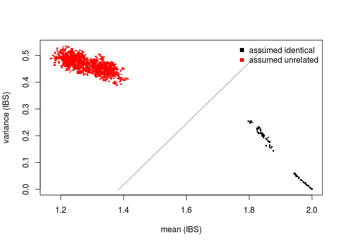

    ## https://ftp.ncbi.nlm.nih.gov/geo/series/GSE52nnn/GSE52980/matrix/

    ## OK

    ## Found 3 file(s)

    ## GSE52980-GPL11154_series_matrix.txt.gz

    ## GSE52980-GPL13534_series_matrix.txt.gz

    ## GSE52980-GPL570_series_matrix.txt.gz

    ## [1] 485512     91

    ## [1] 15

    ##                                                     title  sex age
    ## GSM1255796    genomic DNA from old sun protected dermis 8 male >90
    ## GSM1255806      genomic DNA from old sun exposed dermis 8 male >90
    ## GSM1255834 genomic DNA from old sun protected epidermis 8 male >90
    ## GSM1255844   genomic DNA from old sun exposed epidermis 8 male >90
    ## GSM1255778 genomic DNA from young sun protected dermis 10 male  20
    ## GSM1255788   genomic DNA from young sun exposed dermis 10 male  20
    ##                 exposure    tissue sample_id
    ## GSM1255796 sun protected    dermis         1
    ## GSM1255806   sun exposed    dermis         1
    ## GSM1255834 sun protected epidermis         1
    ## GSM1255844   sun exposed epidermis         1
    ## GSM1255778 sun protected    dermis         2
    ## GSM1255788   sun exposed    dermis         2

    ## [1] 485512     91

    ##            4 7 8 6 3
    ## cg00004073 2 2 3 2 2
    ## cg00017157 2 2 2 2 3
    ## cg00027155 3 2 3 3 3
    ## cg00033213 2 2 1 2 1
    ## cg00035449 1 2 2 2 1

    ## [1] 895  60

    ## Hash relations

    ## There are 0 SNPs dropped because of low call rate!

    ## There are 0 samples set to NA because too little SNPs called!

    ## Using 895 polymorphic SNPs to determine allele sharing.

    ## Running `square` IBS algorithm!

    ## 60 of 1830 (3.28%) ...

    ##       mean       var colnames.x colnames.y  relation
    ## 1 2.000000 0.0000000          4          4 identical
    ## 2 1.355307 0.4463225          7          4 unrelated
    ## 3 1.335196 0.4736480          8          4 unrelated
    ## 4 1.356425 0.4488821          6          4 unrelated
    ## 5 1.362011 0.4303226          3          4 unrelated
    ## 6 1.340782 0.4598003          5          4 unrelated

    ##                   Assumed relation
    ## Predicted relation identical unrelated
    ##          identical       150         .
    ##          unrelated         .      1680

