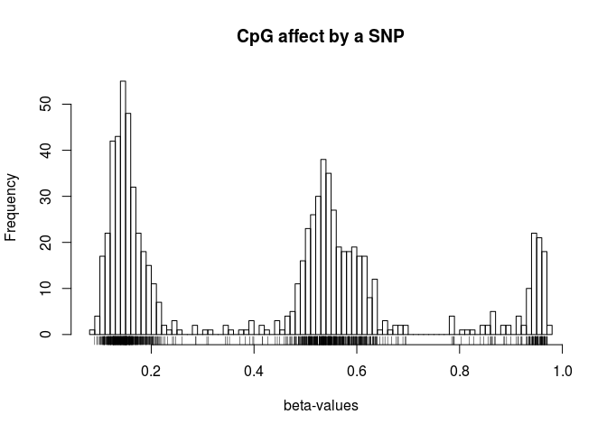
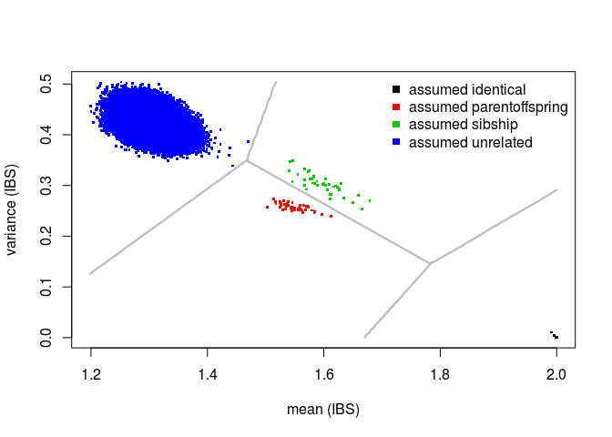

This vignette shows how `omicsPrint` can be used to verify sample relationships using 450k DNA methylation data\[@Bibikova2011\]. In order to run the verification access to the raw idat-files is required as well as an overview of the reported sample relations. It is important to note that all the array should pass quality control, e.g. using [MethylAid](http://bioconductor.org/packages/MethylAid/), since bad-quality array could introduce spurious sample relations.

> If only beta-values are available for the signal probes, i.e. missing the rs-probes, probes containing SNPs should be extracted and if informative enough these could be used!

The following steps are involved:

1.  Construct a targets-file containing path to the raw idat-files
2.  Construct `data.frame` containing reported relations
3.  Extract informative SNPs from 450k DNA methylation data
4.  Convert beta-values to genotypes
5.  Perform the sample matching across all pairs
6.  Report mismatches and provide graphical summary

Construct targets and relations
-------------------------------

This part is specific to each data sets.

In the end you should have a `data.frame` called targets and relations like these:

``` r
head(targets)
```

    ##          ids         uuid biobank_id            run_id C2_Lotnumber
    ## 1   LLS-1311 BIOSDB2BAFE0        LLS 8784233103_R04C01      8783644
    ## 2   LLS-1865 BIOS92B3DB30        LLS 8784233103_R04C02      8783644
    ## 3   LLS-3085 BIOSE66BBFF7        LLS 8795207034_R01C01      8783644
    ## 962 LLS-1006 BIOSD52795D6        LLS 8655685197_R04C02      8783644
    ## 963 LLS-1007 BIOS8D85A896        LLS 8655677092_R01C02      8783644
    ## 964 LLS-1010 BIOSDC61D45E        LLS 8667045031_R03C01      8783644
    ##     Sentrix_Lotnumber  Scan_Date   TEM_Barcode Sentrix_Barcode
    ## 1             8784233 2013-06-25 wg0592288-tem      8784233103
    ## 2             8784233 2013-06-25 wg0592288-tem      8784233103
    ## 3             8795207 2013-06-25 wg0595416-tem      8795207034
    ## 962           8655685 2013-06-21 wg0597544-tem      8655685197
    ## 963           8655677 2013-06-24 wg0591559-tem      8655677092
    ## 964           8667045 2013-06-21 wg0591559-tem      8667045031
    ##        C1_Barcode Scan_Time Stain_Date Sentrix_Position    C2_Barcode
    ## 1   wg0516321-xc1  16:10:04 2013-06-25           R04C01 wg0526054-xc2
    ## 2   wg0516321-xc1  16:25:25 2013-06-25           R04C02 wg0526054-xc2
    ## 3   wg0514750-xc1  18:57:16 2013-06-25           R01C01 wg0525416-xc2
    ## 962 wg0513724-xc1  19:17:37 2013-06-21           R04C02 wg0527860-xc2
    ## 963 wg0513714-xc1  12:10:44 2013-06-21           R01C02 wg0527877-xc2
    ## 964 wg0513714-xc1  19:32:46 2013-06-21           R03C01 wg0527877-xc2
    ##     ATM_Lotnumber TEM_Lotnumber Library_Date Sample_Well   ATM_Barcode
    ## 1         8762691       8615771   2013-06-18         H08 wg0535787-atm
    ## 2         8762691       8615771   2013-06-18         F09 wg0535787-atm
    ## 3         8762691       8615771   2013-06-18         A10 wg0535590-atm
    ## 962       8762691       8615771   2013-06-18         F12 wg0537310-atm
    ## 963       8762691       8615771   2013-06-18         G01 wg0537320-atm
    ## 964       8762691       8615771   2013-06-18         G05 wg0537320-atm
    ##     Hybridization_Date   STM_Barcode C1_Lotnumber Scanner_Name
    ## 1           2013-06-24 wg1577023-stm      8784516         N140
    ## 2           2013-06-24 wg1577023-stm      8784516         N140
    ## 3           2013-06-24 wg1576143-stm      8784516         N140
    ## 962         2013-06-20 wg1567608-stm      8784516         N140
    ## 963         2013-06-20 wg1566700-stm      8784516         N140
    ## 964         2013-06-20 wg1566700-stm      8784516         N140
    ##     Sample_Plate STM_Lotnumber
    ## 1              6       9284859
    ## 2              6       9284859
    ## 3              8       9284859
    ## 962            2       9269715
    ## 963            2       9269715
    ## 964            2       9269715
    ##                                                                                    Basename
    ## 1   /virdir/Scratch/RP3_data//IlluminaHumanMethylation450k/raw/8784233103/8784233103_R04C01
    ## 2   /virdir/Scratch/RP3_data//IlluminaHumanMethylation450k/raw/8784233103/8784233103_R04C02
    ## 3   /virdir/Scratch/RP3_data//IlluminaHumanMethylation450k/raw/8795207034/8795207034_R01C01
    ## 962 /virdir/Scratch/RP3_data//IlluminaHumanMethylation450k/raw/8655685197/8655685197_R04C02
    ## 963 /virdir/Scratch/RP3_data//IlluminaHumanMethylation450k/raw/8655677092/8655677092_R01C02
    ## 964 /virdir/Scratch/RP3_data//IlluminaHumanMethylation450k/raw/8667045031/8667045031_R03C01

Occasionally, it is recommended to relabel some relations, for example using 'gsub':

``` r
head(relations)
```

    ##               idx.x             idx.y              relation_type
    ## 1 8784225039_R05C02 8655685021_R02C01 inferred 1st degree family
    ## 2 8454787098_R03C02 8655685068_R03C02 inferred 1st degree family
    ## 3 9344730116_R03C02 8655685140_R02C02 inferred 1st degree family
    ## 4 9344730095_R05C02 8655685140_R02C02 inferred 1st degree family
    ## 5 8655685068_R02C01 8655685027_R01C02 inferred 1st degree family
    ## 6 8655685054_R04C02 8655685091_R03C02 inferred 1st degree family

``` r
table(relations$relation_type)
```

    ## 
    ##          2nd degree family                  has child 
    ##                          6                        524 
    ##         has dizygotic twin       has monozygotic twin 
    ##                        998                       1853 
    ##                 has parent  has repeated measurements 
    ##                        540                         86 
    ##                    has sib                  identical 
    ##                         99                       6361 
    ## inferred 1st degree family 
    ##                         59

``` r
relations$relation_type <- gsub("2nd degree family", "unrelated", relations$relation_type)
relations$relation_type <- gsub("has repeated measurements|has monozygotic twin", "unrelated", relations$relation_type)
relations$relation_type <- gsub("inferred 1st degree family|has parent|has child", "parentoffspring", relations$relation_type)
relations$relation_type <- gsub("has dizygotic twin|has sib", "sibship", relations$relation_type)
table(relations$relation_type)
```

    ## 
    ##       identical parentoffspring         sibship       unrelated 
    ##            6361            1123            1097            1945

Extract informative SNPs from 450k DNA methylation data
-------------------------------------------------------

The 65 SNPs available on the array are not enough to perform sample verification with high confidence. Fortunately, several probes on the array contain SNPs occuring frequently in different populations\[@chen2013, @Zhou2016\]. We have extended the results of Zhou *et al.* using information from the dutch population [GoNL](http://www.nlgenome.nl/).

``` r
library(DNAmArray)
data(hg19.GoNLsnps)
cpgs <- unique(hg19.GoNLsnps$probe)
library(BiocParallel)
register(MulticoreParam(10))
RGset <- read.metharray.exp.par(targets, verbose=FALSE)
```

    ## Reading multiple idat-files in parallel

    ## Combining the RGsets to one big RGset

``` r
betas <- getBeta(RGset)
betas <- rbind(betas[rownames(betas) %in% cpgs,], getSnpBeta(RGset))
dim(betas)
```

    ## [1] 160791    816

Here, we extract all Illumina probe identifiers that have a GoNL SNP in there probe-sequence (see for more detail ?hg19.GoNLsnps) and the 65 SNPs provided by Illumina. Furthermore, we have used the [DNAmArray](https://github.com/molepi/DNAmArray) `read.metharray.exp.par`-function to read in all idat files in parallel.

Convert beta-values to genotypes
--------------------------------

Now we can convert the beta-values to genotypes (1, 2, 3). We have implemented a K-means clustering approach similar to the one proposed in the [wateRmelon](http://bioconductor.org/packages/wateRmelon/)-package. However, we have added some additional steps to ensure the cluster detected have a good separation and contain sufficient number of samples.

``` r
xCalls <- beta2genotype(betas)
xCalls[1:5, 1:5]
```

    ##            8784233103_R04C01 8454787144_R01C02 8655685185_R06C01
    ## cg03526459                 1                 2                 1
    ## cg08146708                 1                 2                 2
    ## cg11418303                 3                 3                 2
    ## cg16682227                 1                 2                 2
    ## cg20673830                 3                 3                 2
    ##            9374341053_R04C01 8655685041_R02C02
    ## cg03526459                 2                 2
    ## cg08146708                 2                 2
    ## cg11418303                 2                 2
    ## cg16682227                 2                 1
    ## cg20673830                 2                 2

To get an idea of how the K-means clustering algorithm works a plot of the raw beta-values of a CpG affected by a SNP can be generated like this:

``` r
hist(betas[rownames(betas) == rownames(xCalls)[1],], n=100, xlab="beta-values", main="CpG affect by a SNP")
rug(betas[rownames(betas) == rownames(xCalls)[1],])
```



Perform the sample matching across all pairs
--------------------------------------------

We use Identity by State (IBS) for a set of SNPs to infer sample relations\[@Abecasis2001\].

``` r
data <- alleleSharing(x=xCalls, y=NULL, relations=relations, idx.col="idx.x", idy.col="idx.y", verbose=TRUE)
```

    ## Hash relations

    ## Using 850 polymophic SNPs to determine allele sharing.

    ## Running `square` IBS algorithm!

    ## 816 of 333336 (0.24%) ...

    ## 76650 of 333336 (22.99%) ...

    ## 143300 of 333336 (42.99%) ...

    ## 199950 of 333336 (59.98%) ...

    ## 246600 of 333336 (73.98%) ...

    ## 283250 of 333336 (84.97%) ...

    ## 309900 of 333336 (92.97%) ...

    ## 326550 of 333336 (97.96%) ...

    ## 333200 of 333336 (99.96%) ...

``` r
head(data)
```

    ##       mean       var        colnames.x        colnames.y  relation
    ## 1 2.000000 0.0000000 8784233103_R04C01 8784233103_R04C01 identical
    ## 2 1.262353 0.4246117 8454787144_R01C02 8784233103_R04C01 unrelated
    ## 3 1.283529 0.4248167 8655685185_R06C01 8784233103_R04C01 unrelated
    ## 4 1.296471 0.4349699 9374341053_R04C01 8784233103_R04C01 unrelated
    ## 5 1.342353 0.3950239 8655685041_R02C02 8784233103_R04C01 unrelated
    ## 6 1.320000 0.4180919 8655685195_R04C02 8784233103_R04C01 unrelated

The output is a `data.frame` containing all pairwise comparisons with the mean and variance of the IBS over the set of SNPs and the reported and predicted sample relationship, including the identifiers.

Report mismatches and provide graphical summary
-----------------------------------------------

Since, we provided a list of known relations, assuming the majority is correct, we can build a classifier to discover missclassified relations. The current implementation uses linear discriminant analysis and generates a confusion-matrix, graphically representation of the classification boundary and outputs the missclassified sample pairs.

``` r
mismatches <- inferRelations(data)
```

    ##                   Assumed relation
    ## Predicted relation identical parentoffspring sibship unrelated
    ##    identical             819               .       .         .
    ##    parentoffspring         .              49       .         .
    ##    sibship                 .               .      39         .
    ##    unrelated               .               .       .    332429



SessionInfo
===========

``` r
sessionInfo()
```

    ## R version 3.3.2 (2016-10-31)
    ## Platform: x86_64-pc-linux-gnu (64-bit)
    ## Running under: Ubuntu 16.04.2 LTS
    ## 
    ## locale:
    ##  [1] LC_CTYPE=en_US.UTF-8       LC_NUMERIC=C              
    ##  [3] LC_TIME=en_US.UTF-8        LC_COLLATE=en_US.UTF-8    
    ##  [5] LC_MONETARY=en_US.UTF-8    LC_MESSAGES=en_US.UTF-8   
    ##  [7] LC_PAPER=en_US.UTF-8       LC_NAME=C                 
    ##  [9] LC_ADDRESS=C               LC_TELEPHONE=C            
    ## [11] LC_MEASUREMENT=en_US.UTF-8 LC_IDENTIFICATION=C       
    ## 
    ## attached base packages:
    ##  [1] splines   parallel  stats4    methods   stats     graphics  grDevices
    ##  [8] utils     datasets  base     
    ## 
    ## other attached packages:
    ##  [1] IlluminaHumanMethylation450kmanifest_0.4.0
    ##  [2] BiocParallel_1.8.2                        
    ##  [3] omicsPrint_0.0.0.13                       
    ##  [4] MASS_7.3-47                               
    ##  [5] mboost_2.8-0                              
    ##  [6] stabs_0.6-2                               
    ##  [7] glmnet_2.0-10                             
    ##  [8] Matrix_1.2-10                             
    ##  [9] pls_2.6-0                                 
    ## [10] gbm_2.1.3                                 
    ## [11] lattice_0.20-35                           
    ## [12] survival_2.41-3                           
    ## [13] DNAmArray_0.0.2                           
    ## [14] minfi_1.20.2                              
    ## [15] bumphunter_1.14.0                         
    ## [16] locfit_1.5-9.1                            
    ## [17] iterators_1.0.8                           
    ## [18] foreach_1.4.3                             
    ## [19] Biostrings_2.42.1                         
    ## [20] XVector_0.14.1                            
    ## [21] FDb.InfiniumMethylation.hg19_2.2.0        
    ## [22] org.Hs.eg.db_3.4.0                        
    ## [23] TxDb.Hsapiens.UCSC.hg19.knownGene_3.2.2   
    ## [24] GenomicFeatures_1.26.4                    
    ## [25] AnnotationDbi_1.36.2                      
    ## [26] BBMRIomics_1.0.4                          
    ## [27] SummarizedExperiment_1.4.0                
    ## [28] Biobase_2.34.0                            
    ## [29] GenomicRanges_1.26.4                      
    ## [30] GenomeInfoDb_1.10.3                       
    ## [31] IRanges_2.8.2                             
    ## [32] S4Vectors_0.12.2                          
    ## [33] BiocGenerics_0.20.0                       
    ## 
    ## loaded via a namespace (and not attached):
    ##  [1] nlme_3.1-131             bitops_1.0-6            
    ##  [3] matrixStats_0.52.2       RColorBrewer_1.1-2      
    ##  [5] httr_1.2.1               rprojroot_1.2           
    ##  [7] tools_3.3.2              backports_1.1.0         
    ##  [9] doRNG_1.6.6              nor1mix_1.2-2           
    ## [11] R6_2.2.1                 DBI_0.6-1               
    ## [13] base64_2.0               preprocessCore_1.36.0   
    ## [15] sandwich_2.3-4           pkgmaker_0.22           
    ## [17] rtracklayer_1.34.2       mvtnorm_1.0-6           
    ## [19] nnls_1.4                 readr_1.1.1             
    ## [21] genefilter_1.56.0        quadprog_1.5-5          
    ## [23] stringr_1.2.0            digest_0.6.12           
    ## [25] Rsamtools_1.26.2         illuminaio_0.16.0       
    ## [27] rmarkdown_1.5            siggenes_1.48.0         
    ## [29] GEOquery_2.40.0          htmltools_0.3.6         
    ## [31] limma_3.30.13            BSgenome_1.42.0         
    ## [33] rlang_0.1.1              RSQLite_1.1-2           
    ## [35] zoo_1.8-0                jsonlite_1.4            
    ## [37] mclust_5.3               VariantAnnotation_1.20.3
    ## [39] RCurl_1.95-4.8           magrittr_1.5            
    ## [41] modeltools_0.2-21        Rcpp_0.12.11            
    ## [43] multcomp_1.4-6           stringi_1.1.5           
    ## [45] yaml_2.1.14              zlibbioc_1.20.0         
    ## [47] plyr_1.8.4               grid_3.3.2              
    ## [49] strucchange_1.5-1        multtest_2.30.0         
    ## [51] annotate_1.52.1          hms_0.3                 
    ## [53] knitr_1.16               beanplot_1.2            
    ## [55] party_1.2-3              rngtools_1.2.4          
    ## [57] codetools_0.2-15         biomaRt_2.30.0          
    ## [59] XML_3.98-1.7             evaluate_0.10           
    ## [61] data.table_1.10.4        openssl_0.9.6           
    ## [63] RevoUtilsMath_10.0.0     reshape_0.8.6           
    ## [65] coin_1.1-3               xtable_1.8-2            
    ## [67] tibble_1.3.1             GenomicAlignments_1.10.1
    ## [69] registry_0.3             memoise_1.1.0           
    ## [71] TH.data_1.0-8

Reference
=========
