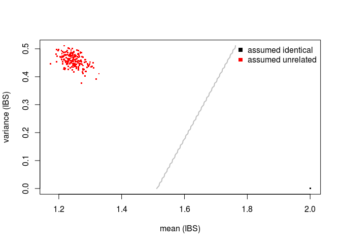

Introduction
------------

Verify sample relations: 450K data
----------------------------------

``` r
head(targets)
```

    ##          ids         uuid biobank_id            run_id C2_Lotnumber
    ## 1   LLS-1311 BIOSDB2BAFE0        LLS 8784233103_R04C01      8783644
    ## 2   LLS-1865 BIOS92B3DB30        LLS 8784233103_R04C02      8783644
    ## 3   LLS-3085 BIOSE66BBFF7        LLS 8795207034_R01C01      8783644
    ## 962 LLS-1006 BIOSD52795D6        LLS 8655685197_R04C02      8783644
    ## 963 LLS-1007 BIOS8D85A896        LLS 8655677092_R01C02      8783644
    ## 964 LLS-1010 BIOSDC61D45E        LLS 8667045031_R03C01      8783644
    ##     Sentrix_Lotnumber  Scan_Date   TEM_Barcode Sentrix_Barcode
    ## 1             8784233 2013-06-25 wg0592288-tem      8784233103
    ## 2             8784233 2013-06-25 wg0592288-tem      8784233103
    ## 3             8795207 2013-06-25 wg0595416-tem      8795207034
    ## 962           8655685 2013-06-21 wg0597544-tem      8655685197
    ## 963           8655677 2013-06-24 wg0591559-tem      8655677092
    ## 964           8667045 2013-06-21 wg0591559-tem      8667045031
    ##        C1_Barcode Scan_Time Stain_Date Sentrix_Position    C2_Barcode
    ## 1   wg0516321-xc1  16:10:04 2013-06-25           R04C01 wg0526054-xc2
    ## 2   wg0516321-xc1  16:25:25 2013-06-25           R04C02 wg0526054-xc2
    ## 3   wg0514750-xc1  18:57:16 2013-06-25           R01C01 wg0525416-xc2
    ## 962 wg0513724-xc1  19:17:37 2013-06-21           R04C02 wg0527860-xc2
    ## 963 wg0513714-xc1  12:10:44 2013-06-21           R01C02 wg0527877-xc2
    ## 964 wg0513714-xc1  19:32:46 2013-06-21           R03C01 wg0527877-xc2
    ##     ATM_Lotnumber TEM_Lotnumber Library_Date Sample_Well   ATM_Barcode
    ## 1         8762691       8615771   2013-06-18         H08 wg0535787-atm
    ## 2         8762691       8615771   2013-06-18         F09 wg0535787-atm
    ## 3         8762691       8615771   2013-06-18         A10 wg0535590-atm
    ## 962       8762691       8615771   2013-06-18         F12 wg0537310-atm
    ## 963       8762691       8615771   2013-06-18         G01 wg0537320-atm
    ## 964       8762691       8615771   2013-06-18         G05 wg0537320-atm
    ##     Hybridization_Date   STM_Barcode C1_Lotnumber Scanner_Name
    ## 1           2013-06-24 wg1577023-stm      8784516         N140
    ## 2           2013-06-24 wg1577023-stm      8784516         N140
    ## 3           2013-06-24 wg1576143-stm      8784516         N140
    ## 962         2013-06-20 wg1567608-stm      8784516         N140
    ## 963         2013-06-20 wg1566700-stm      8784516         N140
    ## 964         2013-06-20 wg1566700-stm      8784516         N140
    ##     Sample_Plate STM_Lotnumber
    ## 1              6       9284859
    ## 2              6       9284859
    ## 3              8       9284859
    ## 962            2       9269715
    ## 963            2       9269715
    ## 964            2       9269715
    ##                                                                                    Basename
    ## 1   /virdir/Scratch/RP3_data//IlluminaHumanMethylation450k/raw/8784233103/8784233103_R04C01
    ## 2   /virdir/Scratch/RP3_data//IlluminaHumanMethylation450k/raw/8784233103/8784233103_R04C02
    ## 3   /virdir/Scratch/RP3_data//IlluminaHumanMethylation450k/raw/8795207034/8795207034_R01C01
    ## 962 /virdir/Scratch/RP3_data//IlluminaHumanMethylation450k/raw/8655685197/8655685197_R04C02
    ## 963 /virdir/Scratch/RP3_data//IlluminaHumanMethylation450k/raw/8655677092/8655677092_R01C02
    ## 964 /virdir/Scratch/RP3_data//IlluminaHumanMethylation450k/raw/8667045031/8667045031_R03C01

``` r
library(DNAmArray)
data(hg19.GoNLsnps)
cpgs <- unique(hg19.GoNLsnps$probe)
library(BiocParallel)
register(MulticoreParam(2))
RGset <- read.metharray.exp.par(targets[1:20,], verbose=FALSE)
```

    ## Reading multiple idat-files in parallel

    ## Combining the RGsets to one big RGset

``` r
betas <- getBeta(RGset)
```

    ## Loading required package: IlluminaHumanMethylation450kmanifest

``` r
betas <- rbind(betas[rownames(betas) %in% cpgs,], getSnpBeta(RGset))
dim(betas)
```

    ## [1] 160791     20

``` r
xCalls <- beta2genotype(betas)
```

``` r
head(relations)
```

    ##               idx.x             idx.y relation_type
    ## 1 3999547088_R05C02 3999547077_R05C01    has parent
    ## 2 3999547088_R06C01 9985178120_R05C01     has child
    ## 3 9647455030_R05C01 3999547105_R02C01    has parent
    ## 4 3999547088_R05C02 9647455030_R03C02    has parent
    ## 5 3999547015_R01C01 9422491040_R04C02    has parent
    ## 6 9985178120_R02C01 3999547077_R05C02     has child

``` r
rHash <- hashRelations(relations, idx.col="idx.x", idy.col="idx.y")
```

``` r
data <- alleleSharing(x=xCalls, y=NULL, rHash=rHash, verbose=TRUE)
```

    ## Using 653 polymophic SNPs to determine allele sharing.

    ## Running `square` IBS algorithm!

    ## 20 of 210 (9.52%) ...

``` r
head(data)
```

    ##       mean       var        colnames.x        colnames.y  relation
    ## 1 2.000000 0.0000000 8784233103_R04C01 8784233103_R04C01 identical
    ## 2 1.254211 0.4536824 8795207034_R01C01 8784233103_R04C01 unrelated
    ## 3 1.284839 0.4187422 8655677092_R01C02 8784233103_R04C01 unrelated
    ## 4 1.246554 0.4559889 8454787147_R05C02 8784233103_R04C01 unrelated
    ## 5 1.272588 0.4531892 8655685185_R01C02 8784233103_R04C01 unrelated
    ## 6 1.205207 0.4700955 8454787144_R01C02 8784233103_R04C01 unrelated

``` r
predict(data)
```

    ##                   Assumed relation
    ## Predicted relation identical unrelated
    ##          identical        20         .
    ##          unrelated         .       190



SessionInfo
-----------

``` r
sessionInfo()
```

    ## R version 3.3.2 (2016-10-31)
    ## Platform: x86_64-pc-linux-gnu (64-bit)
    ## Running under: Ubuntu 16.04.2 LTS
    ## 
    ## locale:
    ##  [1] LC_CTYPE=en_US.UTF-8       LC_NUMERIC=C              
    ##  [3] LC_TIME=en_US.UTF-8        LC_COLLATE=en_US.UTF-8    
    ##  [5] LC_MONETARY=en_US.UTF-8    LC_MESSAGES=en_US.UTF-8   
    ##  [7] LC_PAPER=en_US.UTF-8       LC_NAME=C                 
    ##  [9] LC_ADDRESS=C               LC_TELEPHONE=C            
    ## [11] LC_MEASUREMENT=en_US.UTF-8 LC_IDENTIFICATION=C       
    ## 
    ## attached base packages:
    ## [1] parallel  stats4    stats     graphics  grDevices utils     datasets 
    ## [8] methods   base     
    ## 
    ## other attached packages:
    ##  [1] IlluminaHumanMethylation450kmanifest_0.4.0
    ##  [2] BiocParallel_1.8.2                        
    ##  [3] DNAmArray_0.0.2                           
    ##  [4] minfi_1.20.2                              
    ##  [5] bumphunter_1.14.0                         
    ##  [6] locfit_1.5-9.1                            
    ##  [7] iterators_1.0.8                           
    ##  [8] foreach_1.4.3                             
    ##  [9] Biostrings_2.42.1                         
    ## [10] XVector_0.14.1                            
    ## [11] FDb.InfiniumMethylation.hg19_2.2.0        
    ## [12] org.Hs.eg.db_3.4.0                        
    ## [13] TxDb.Hsapiens.UCSC.hg19.knownGene_3.2.2   
    ## [14] GenomicFeatures_1.26.4                    
    ## [15] AnnotationDbi_1.36.2                      
    ## [16] omicsPrint_0.0.0.10                       
    ## [17] BBMRIomics_1.0.4                          
    ## [18] SummarizedExperiment_1.4.0                
    ## [19] Biobase_2.34.0                            
    ## [20] GenomicRanges_1.26.4                      
    ## [21] GenomeInfoDb_1.10.3                       
    ## [22] IRanges_2.8.2                             
    ## [23] S4Vectors_0.12.2                          
    ## [24] BiocGenerics_0.20.0                       
    ## 
    ## loaded via a namespace (and not attached):
    ##  [1] nlme_3.1-131             bitops_1.0-6            
    ##  [3] matrixStats_0.52.2       RColorBrewer_1.1-2      
    ##  [5] httr_1.2.1               rprojroot_1.2           
    ##  [7] tools_3.3.2              backports_1.0.5         
    ##  [9] doRNG_1.6.6              nor1mix_1.2-2           
    ## [11] R6_2.2.0                 DBI_0.6-1               
    ## [13] gbm_2.1.3                base64_2.0              
    ## [15] preprocessCore_1.36.0    glmnet_2.0-10           
    ## [17] pkgmaker_0.22            sandwich_2.3-4          
    ## [19] rtracklayer_1.34.2       nnls_1.4                
    ## [21] mvtnorm_1.0-6            genefilter_1.56.0       
    ## [23] readr_1.1.0              quadprog_1.5-5          
    ## [25] stringr_1.2.0            digest_0.6.12           
    ## [27] Rsamtools_1.26.2         illuminaio_0.16.0       
    ## [29] rmarkdown_1.4            siggenes_1.48.0         
    ## [31] GEOquery_2.40.0          htmltools_0.3.5         
    ## [33] limma_3.30.13            BSgenome_1.42.0         
    ## [35] RSQLite_1.1-2            zoo_1.8-0               
    ## [37] jsonlite_1.4             mclust_5.2.3            
    ## [39] VariantAnnotation_1.20.3 RCurl_1.95-4.8          
    ## [41] magrittr_1.5             modeltools_0.2-21       
    ## [43] Matrix_1.2-8             Rcpp_0.12.10            
    ## [45] stringi_1.1.5            multcomp_1.4-6          
    ## [47] yaml_2.1.14              MASS_7.3-45             
    ## [49] zlibbioc_1.20.0          plyr_1.8.4              
    ## [51] grid_3.3.2               pls_2.6-0               
    ## [53] strucchange_1.5-1        lattice_0.20-35         
    ## [55] splines_3.3.2            annotate_1.52.1         
    ## [57] multtest_2.30.0          hms_0.3                 
    ## [59] knitr_1.15.1             beanplot_1.2            
    ## [61] mboost_2.8-0             party_1.2-3             
    ## [63] rngtools_1.2.4           codetools_0.2-15        
    ## [65] biomaRt_2.30.0           XML_3.98-1.6            
    ## [67] evaluate_0.10            data.table_1.10.4       
    ## [69] openssl_0.9.6            RevoUtilsMath_10.0.0    
    ## [71] reshape_0.8.6            coin_1.1-3              
    ## [73] xtable_1.8-2             survival_2.41-3         
    ## [75] tibble_1.3.0             GenomicAlignments_1.10.1
    ## [77] registry_0.3             memoise_1.0.0           
    ## [79] TH.data_1.0-8            stabs_0.6-2
